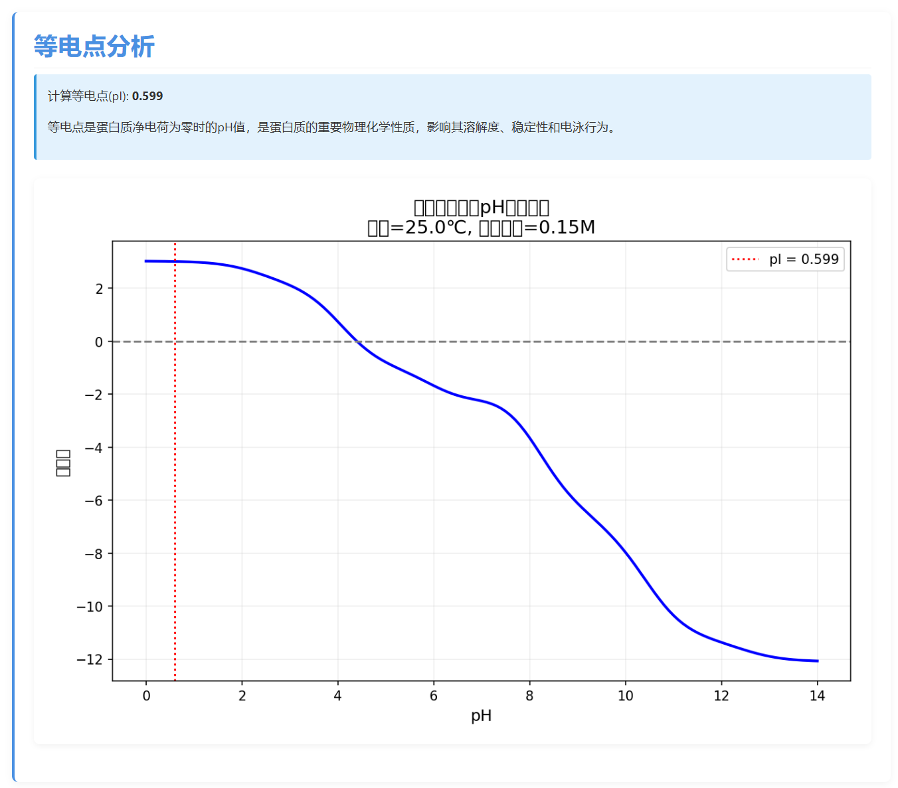
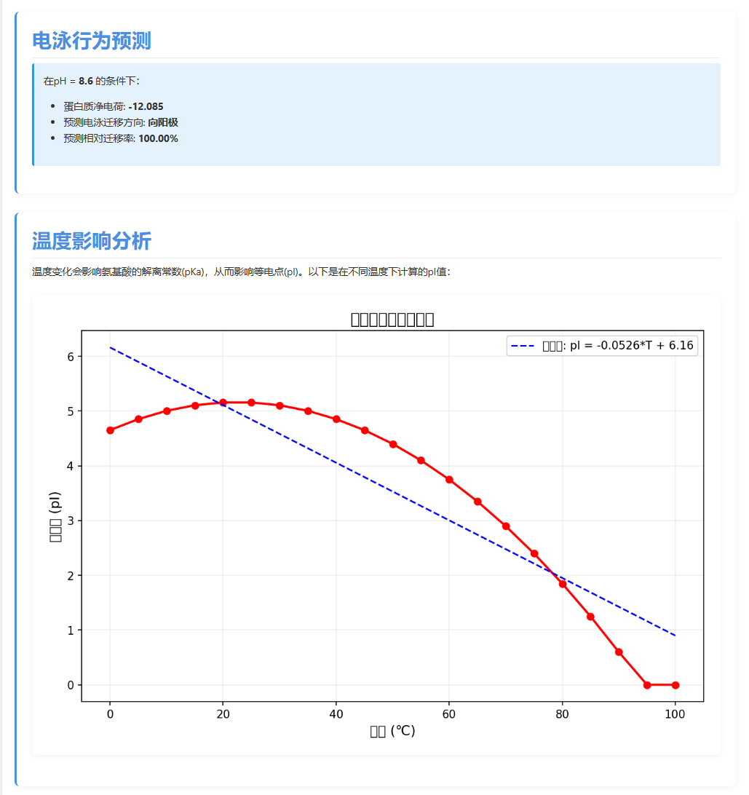
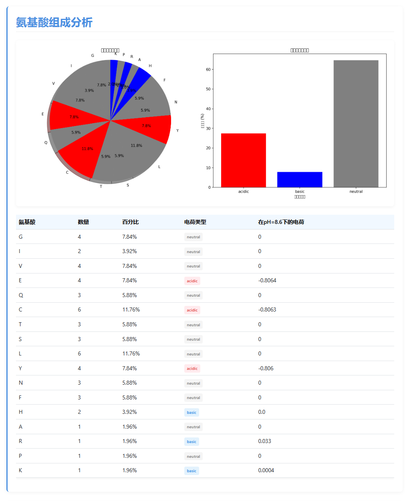
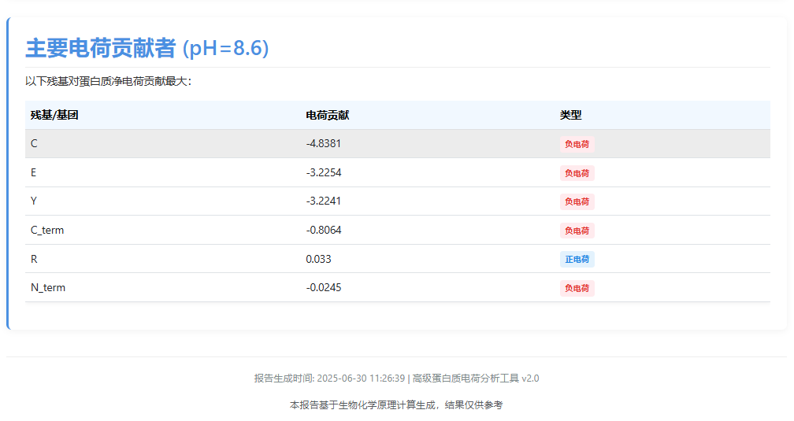

# 蛋白质等电点与电荷分析工具

## 项目描述
本工具是一个用于计算蛋白质等电点(pI)和分析电荷分布的生物信息学工具，基于Python开发。它能够：
    1.精确计算蛋白质的等电点(pI)
    2.分析不同pH条件下的净电荷变化
    3.预测蛋白质在电泳中的迁移行为
    4.可视化电荷-pH分布曲线
    5.分析温度对等电点的影响
    6.生成详细的HTML分析报告
该项目结合了生物化学理论和Python科学计算，避开了复杂的二级结构预测，专注于蛋白质的电荷特性分析，结果可验证性强。

## 功能特点
### 核心功能
    等电点(pI)精确计算
    电荷-pH分布可视化
    电荷-pH分布可视化
    温度影响分析
    氨基酸组成分析
### 高级特性
    PDB文件支持
    翻译后修饰（PTM）效应计算
    离子强度影响分析
    HTML生成报告

## 安装依赖
### 环境要求
* Python 3.7+
* pip 包管理工具

### 安装步骤

    python -m venv venv
    source venv/bin/activate
    pip install -r requirements.txt

### 使用方式
    （1）使用序列直接分析
    ``
        python main.py -s "GIVEQCCTSICSLYQLENYCNFVNQHLCGSHLVEALYLVCGERGFFYTPKT"
    ``
    （2）使用FASTA文件
    ``   
        python main.py -f data/sample.fasta
     ``
    （3）使用PDB文件
    ``
        python main.py --pdb data/1ins.pdb --chain A
    ``
    
    可选参数
    参数	            说明	            默认值
    -s, --sequence	  直接输入蛋白质序列	    -
    -f, --fasta	  FASTA文件路径	            -
    --pdb	          PDB文件路径	            -
    --chain	          PDB链ID	           'A'
    -o, --output	  输出报告文件名	        自动生成
    --ph	          电泳pH条件	           8.6
    --temperature	  温度(℃)	           25.0
    --ionic_strength  离子强度(M)	           0.15
    --plot	          显示图表	          不显示
    --custom_pka	  自定义pKa值CSV文件	    -
    --ptm_config	  PTM配置文件	       data/ptm_config.csv
    --pymol	          生成PyMOL可视化脚本       不生成

## 运行效果
    目录中的html文件
    
    
    
    