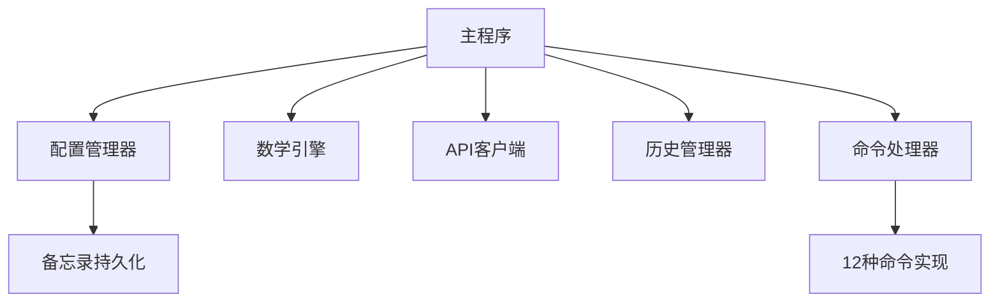

# DeepSeek聊天机器人技术文档

## 一、实现目标

本程序实现了一个基于DeepSeek API的命令行聊天机器人，主要目标包括：

- 自然语言交互：通过DeepSeek API实现智能对话

- 数学计算引擎：内置本地数学表达式解析和计算能力

- 多功能命令系统：支持12种实用命令（计算/验证/备忘录等）

- 上下文管理：维护对话历史记录实现多轮对话

- 数据持久化：备忘录的本地存储和读取

- 用户友好界面：彩色命令行提示和格式化输出

## 二、核心架构



## 三、主要模块实现思路

### 1. 配置管理器 (ConfigManager)

- API密钥和端点配置

- 系统提示词动态生成（含当前日期）

- 备忘录JSON文件读写

- 聊天机器人参数配置（历史记录长度/用户名等）

### 2. 数学引擎 (MathEngine)

- 表达式解析：

```python
tokens = self.tokenize_expression("sin(pi/2)") 
# 输出：['sin', '(', 'pi', '/', '2', ')']
```

- 调度场算法：中缀表达式 → 后缀表达式

- 支持功能：

	- 28个数学函数/常量（sin/cos/pi/e等）

	- 运算符优先级处理

	- 浮点精度优化（3.0 → 3）

### 3. API客户端 (DeepSeekAPIClient)

- 请求封装：
```json
{
  "model": "deepseek-reasoner",
  "messages": [{"role":"system", "content":...}],
  "max_tokens": 4096,
  "temperature": 0.7
}
```

- 性能统计：请求次数/耗时/Token用量

### 4. 历史管理器 (ChatHistoryManager)

- 双端队列存储（固定容量）

- 包含系统提示的完整上下文

- 彩色格式化输出：

```text
1. 用户: 2+2等于几?
2. 助手: 2+2=4
```

### 5. 命令处理器 (CommandHandler)

|命令类型|	功能说明	|示例|
|--|--|--|
|/calc	|数学表达式计算|	/calc 2^3+sqrt(9)|
|/verify|	验证计算结果|	/verify 2*3=5|
|/memo|	备忘录管理|	/memo 重要会议|
|/history|	查看对话历史|	/history|
|/config|	显示当前配置|	/config|

## 四、核心算法亮点

### 1. 数学表达式验证算法：

```python
def verify_calculation(statement):
    # 匹配模式：表达式=结果
    match = re.match(r'(.+?)(?:=|等于|是)\s*([\d.]+)', statement)
    # 计算实际值并与用户结果对比
    return abs(actual - user) < 1e-10
```

### 2. 命令路由机制：

```python
command_map = {
    "help": CommandType.HELP,
    "calc": CommandType.CALC,
    "memo": CommandType.MEMO,
    ...
}
```

### 3. 自动数学检测：

- 正则模式匹配数学表达式

- 优先级：验证请求 > 计算指令 > 纯数学表达式

## 五、用户体验优化

### 1. 彩色终端输出：

- 错误消息：红色

- 成功结果：绿色

- 系统提示：蓝色

### 2. 命令历史记忆：

- 通过readline库实现`.deepseek_history`

### 3. 智能数学干预：

- 自动拦截数学问题，减少API调用

### 4. 内存安全设计：

- 固定长度的历史记录队列

- 异常安全的数据持久化

