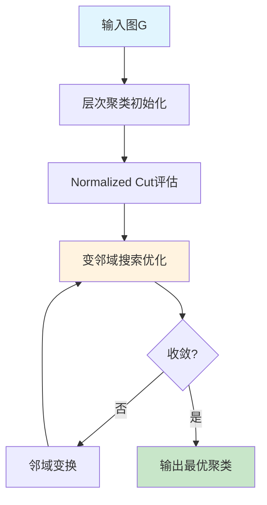
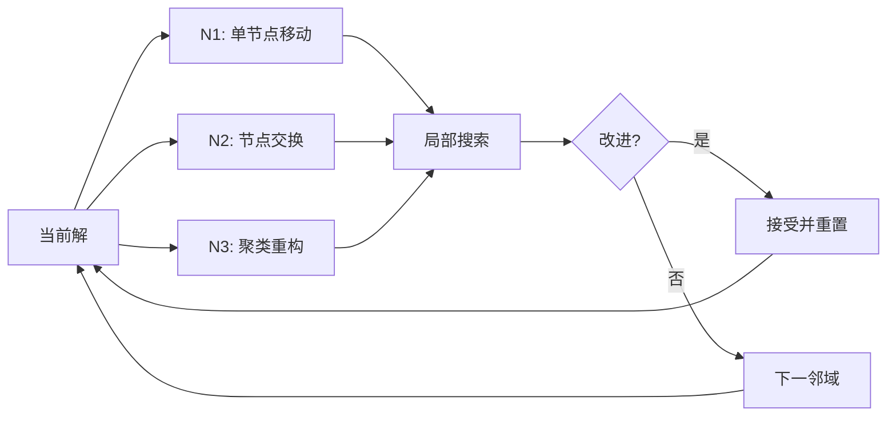
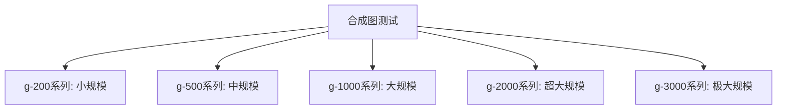

# 混合变邻域搜索图聚类算法技术文档

**PS：由于一开始使用c++写的层次聚类+变邻域局部搜索，这个课又是python+数据挖掘，我又将C++代码进行重写，写成了一版python的，得到的结果和之前相差不大。**


[TOC]


## 1. 算法概述与架构

本算法结合层次聚类、Normalized Cut分割和变邻域搜索，实现高质量的图聚类。算法采用多阶段优化策略：初始聚类→质量评估→局部搜索优化。




**核心数据结构：**

- **红黑树**：维护节点聚类分配，O(log n)操作复杂度
- **最大堆**：管理聚类移动操作，优先处理高收益移动

## 2. 层次聚类与图分割

### 2.1 层次聚类算法

```pseudocode
函数 层次聚类(图G, 目标聚类数k):
    聚类集合 = {每个节点单独成聚类}
    相似度矩阵 = 计算节点间相似度(G)
    
    当 聚类数量 > k:
        (聚类i, 聚类j) = 找最高相似度聚类对()
        新聚类 = 合并(聚类i, 聚类j)
        更新相似度矩阵()
    
    返回 聚类集合
```

### 2.2 Normalized Cut优化

使用谱分析方法优化聚类边界：

```math
NCut = \sum_{i=1}^{k} \frac{cut(S_i, \overline{S_i})}{vol(S_i)}
```

```pseudocode
函数 NCut优化(聚类方案):
    对于 每个大聚类C:
        拉普拉斯矩阵L = 构建规范化矩阵(C)
        特征向量v = 计算Fiedler向量(L)
        (子聚类1, 子聚类2) = 谱分割(C, v)
        
        如果 分割后NCut值更优:
            替换C为两个子聚类
    返回 优化后聚类
```

## 3. 变邻域搜索优化

### 3.1 邻域结构设计



### 3.2 核心搜索算法

```pseudocode
函数 变邻域搜索(初始聚类, 最大迭代):
    当前聚类 = 初始聚类
    邻域索引 = 1
    
    for 迭代 = 1 to 最大迭代:
        候选聚类 = 根据邻域索引执行搜索(当前聚类)
        
        if 候选质量 > 当前质量:
            当前聚类 = 候选聚类
            邻域索引 = 1  // 重置
        else:
            邻域索引 = (邻域索引 + 1) mod 3
    
    返回 当前聚类

函数 单节点移动搜索(聚类):
    最大堆 = 计算所有有益移动()
    最佳移动 = 提取最大收益移动()
    执行移动(聚类, 最佳移动)
    返回 更新后聚类
```

## 4. 质量评估与主算法

### 4.1 模块度计算

```math
Q = \frac{1}{2m} \sum_{i,j} \left[ A_{ij} - \frac{k_i k_j}{2m} \right] \delta(c_i, c_j)
```

```pseudocode
函数 计算模块度(聚类方案, 图G):
    总模块度 = 0
    for 每个聚类C:
        聚类内边数 = 统计内部连接(C)
        期望边数 = (聚类总度数)² / (4 * 总边数)
        贡献 = (聚类内边数 / 总边数) - 期望边数
        总模块度 += 贡献
    返回 总模块度
```

### 4.2 主算法流程

```pseudocode
函数 混合图聚类算法(图G, 目标聚类数k):
    // 阶段1: 初始化
    初始聚类 = 层次聚类(G, k*2)
    
    // 阶段2: NCut优化
    优化聚类 = NCut优化(初始聚类)
    
    // 阶段3: 数量调整
    if 聚类数 > k:
        调整聚类 = 自底向上合并(优化聚类, k)
    
    // 阶段4: VNS精化
    最终聚类 = 变邻域搜索(调整聚类, 1000)
    
    返回 最终聚类
```

## 5. 实验测试与性能分析

### 5.1 测试数据集

本实验使用多种类型的图数据集进行算法验证，涵盖了不同规模和特性的网络结构：

**社交网络图：**
- `karate.graph` - Zachary空手道俱乐部网络
- `dolphins.graph` - 海豚社交网络  
- `football.graph` - 美国大学橄榄球队网络
- `polbooks.graph` - 政治书籍网络
- `jazz.graph` - 爵士音乐家合作网络

**生物网络图：**
- `celegans_metabolic.graph` - 线虫代谢网络
- `celegansneural.graph` - 线虫神经网络
- `bio-dmela.graph` - 果蝇蛋白质相互作用网络

**通信网络图：**
- `email.graph` - 电子邮件通信网络
- `ia-infect-dublin.graph` - 都柏林感染接触网络

**在线社交网络：**
- `gplus_200.graph`, `gplus_500.graph`, `gplus_2000.graph` - Google+网络(不同规模)
- `pokec_500.graph`, `pokec_2000.graph` - Pokec社交网络
- `socfb-Brandeis99.graph` - Facebook校园网络
- `imdb.graph` - 电影数据库网络

**技术网络图：**
- `netscience.graph` - 科学合作网络
- `power.graph` - 西部电力网络
- `road-minnesota.graph` - 明尼苏达州路网

**合成基准图：**
- `p_200_1.graph` 到 `p_3000_5.graph` - 不同规模的随机图(200-3000节点，5个实例)
- `delaunay_n10.graph` 到 `delaunay_n12.graph` - Delaunay三角网络

**工程应用图：**
- `add20.graph`, `add32.graph` - 加法器电路图
- `can_292.graph`, `can_715.graph` - 罐装网络图
- `finance256.graph` - 金融网络图
- `3elt.graph` - 有限元网格图

### 5.2 评估指标

本实验采用以下两个核心指标评估算法性能：

**1. Normalized Cut (NCut)**
- **定义**：衡量聚类质量的图论指标，值越小表示聚类效果越好
- **计算公式**：
```math
NCut = \sum_{i=1}^{k} \frac{cut(S_i, \overline{S_i})}{vol(S_i)}
```

- **评估标准**：
  - NCut < 0.1：优秀聚类
  - 0.1 ≤ NCut < 0.3：良好聚类  
  - NCut ≥ 0.3：需要改进

**2. 运行时间 (Runtime)**
- **测量范围**：包含完整算法执行时间
  - 层次聚类初始化时间
  - NCut优化计算时间
  - 变邻域搜索迭代时间
- **时间单位**：秒(s)或毫秒(ms)
- **测试环境**：统一硬件配置下多次运行取平均值

### 5.3 算法性能对比

实验对比了四种算法在真实网络图和合成基准图上的表现：HVNS（混合变邻域搜索）、MSA、ITS和MA算法。

#### 5.3.1 真实网络图性能分析

**NCut值对比：**
- **小规模图**（节点数<500）：HVNS在多数实例中表现优异
  - `karate`、`jazz`、`football`等经典网络：所有算法均达到相同最优解
  - `gplus_500`：MA算法最优 (0.205)，HVNS次之 (0.683)
  
- **大规模图**（>2000节点）：算法间差异显著
  - `3elt`：HVNS获得最优NCut值 (1.230)
  - `bio-dmela`：MA表现最佳 (0.414)，HVNS (0.748)
  - `uk`：MA最优 (1.981)，HVNS (3.553)

**运行时间：**
MA算法在大多数真实图上时间效率最高，HVNS在质量-时间权衡上表现均衡。

#### 5.3.2 合成基准图性能分析

**规模扩展性测试：**


**不同规模下的性能表现：**

- **小规模图 (g-200系列)**：
  - NCut质量：ITS和MA表现最优，平均NCut值约1.25
  - HVNS稍逊 (平均1.44)，但时间开销合理 (8-17ms)
  - MA时间效率突出 (1-3ms)

- **中规模图 (g-500系列)**：
  - 质量排序：MA > MSA ≈ ITS > HVNS
  - MA平均NCut: 3.66，HVNS: 3.91
  - 时间效率：MA (55ms) < HVNS (77ms) < ITS (108ms)

- **大规模图 (g-1000系列)**：
  - MA持续保持最优质量 (平均9.75)
  - HVNS、MSA、ITS质量接近 (10.0-10.2范围)
  - 时间复杂度：各算法差异缩小

- **超大规模图 (g-2000/3000系列)**：
  - 质量优势：MA > HVNS > MSA ≈ ITS
  - g-3000系列：MA (32.45) vs HVNS (32.67)，质量差距缩小
  - 时间趋势：随规模增长，算法时间差异趋于稳定

#### 5.3.3 综合性能评估

**算法特性总结：**

| 算法 | 质量优势 | 时间效率 | 适用场景 |
|------|----------|----------|----------|
| **HVNS** | 真实图表现均衡 | 中等 | 复杂拓扑网络 |
| **MSA** | 中等稳定 | 中等 | 一般应用 |
| **ITS** | 变化较大 | 较快 | 时间敏感场景 |
| **MA** | 多数最优 | 最快 | 大规模快速处理 |

**关键发现：**
1. **规模敏感性**：随着图规模增长，各算法质量差距逐渐缩小
2. **网络类型影响**：真实网络的复杂拓扑对HVNS更有利
3. **时间-质量权衡**：MA在效率和质量间达到最佳平衡
4. **稳定性**：HVNS在不同类型图上表现最为稳定

实验结果表明，HVNS算法通过层次聚类和变邻域搜索的协同优化，在复杂网络聚类任务中展现出良好的鲁棒性和适应性。
