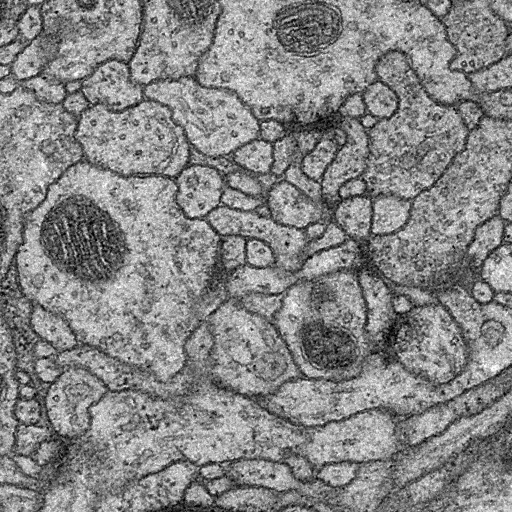

# 文档说明

该项目基于Keras搭建一个简单的unet，目的是用医学图像数据集对unet进行训练，完成模型的保存和加载和图像分割测试。

环境： 
keras：2.13.1 
tensorflow：2.13.1  
项目内目录中三个文件夹： 

1. /datasets：保存数据集文件 
2. /save_models：保存训练好的模型权重文件 
3. /save_results：保存测试的图像结果文件 

UNet介绍： 
UNet 属于 FCN 的一种变体，它可以说是最常用、最简单的一种分割模型。 
UNet 在2015 年被提出，它简单、高效、易懂、容易构建，且可以从小数据集中训练。 
UNet 的初衷是为了解决医学图像分割的问题，在解决细胞层面的分割的任务方面，其在 2015 年的 ISBI cell tracking 比赛中获得了多个第一。 
之后，UNet 凭借其突出的分割效果而被广泛应用在语义分割的各个方向（如卫星图像分割，工业瑕疵检测等）。 

关于使用： 
1. 添加医学影像数据的训练集和测试集（里面包含原始图像和分割图像）到datasets目录下 

  

2. 安装好对应的依赖环境（主要是keras和tensorflow） 

3. 开启训练，运行train.py（运行前把模型结果和训练数据路径设置好）

  

4. 运行test.py，得到分割的结果。

  

