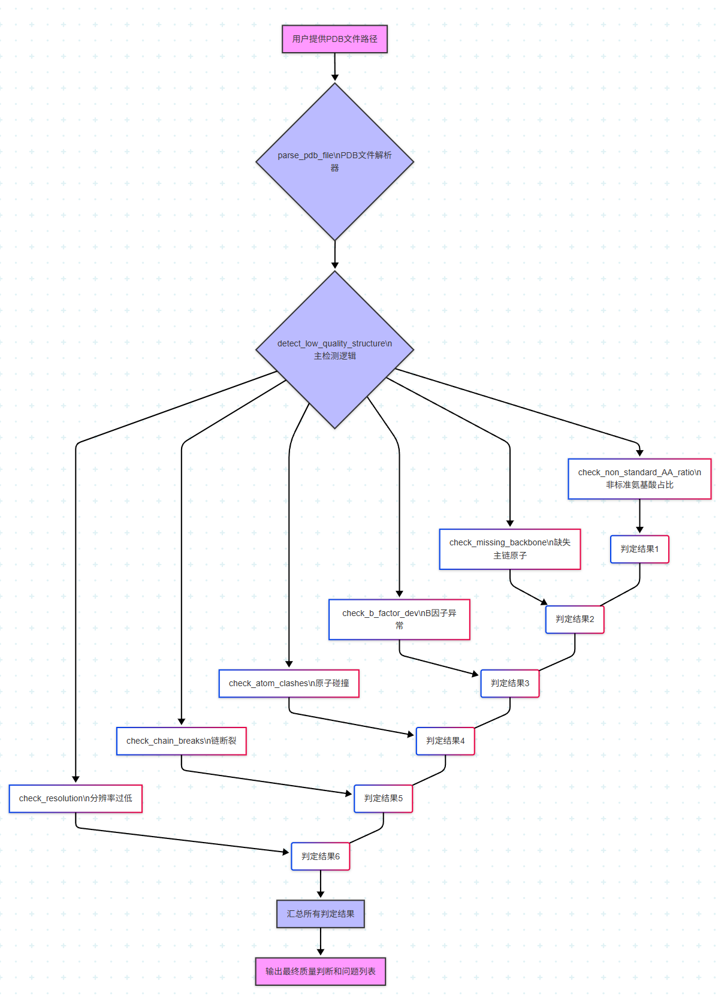

## **项目简要文档说明：蛋白质结构质量检测器**

### **1\. 项目目标**

本项目旨在开发一个Python程序，用于评估给定蛋白质PDB（Protein Data Bank）文件的结构质量。通过分析PDB文件中的原子和残基信息，程序将根据一系列预定义的标准，判断蛋白质结构是否属于低质量。这有助于研究人员快速筛选出可能存在实验或解析缺陷的结构。

### **2\. 代码实现目标和主要思路**

#### **2.1 主要模块和功能**

程序主要由以下几个部分组成：

1. **PDB文件解析器 (parse\_pdb\_file):**  
   * **目标:** 从PDB文件中准确提取原子（ATOM, HETATM）和残基信息，以及可能的分辨率信息。  
   * **思路:**  
     * 逐行读取PDB文件。  
     * 识别以 "ATOM" 或 "HETATM" 开头的行，并根据PDB格式规范（PDB Format Guide）解析出原子的各种属性（原子序列号、原子名、残基名、链ID、坐标、B因子、占有率等）。  
     * 将解析后的原子封装成Atom对象。  
     * 将属于同一残基的原子聚合到Residue对象中，方便后续基于残基的检查。  
     * 尝试从 REMARK 2 或 REMARK 3 中提取X射线衍射分辨率信息。  
     * 返回包含所有原子、残基和分辨率的字典。  
2. 质量检测函数:  
   针对每个低质量判断标准，编写独立的函数进行检查。每个函数都返回一个布尔值（是否低质量）和一条详细说明信息。  
   * **2.1.1 check\_non\_standard\_amino\_acid\_percentage (非标准氨基酸占比):**  
     * **目标:** 判断蛋白质结构中非标准氨基酸的比例是否过高。  
     * **思路:**  
       * 遍历所有解析到的残基。  
       * 维护一个已知标准氨基酸的集合 (STANDARD\_AMINO\_ACIDS)。  
       * 统计非标准氨基酸残基的数量和总残基数量。  
       * 计算非标准氨基酸的百分比。如果超过50%，则标记为低质量。  
   * **2.1.2 check\_missing\_backbone\_atoms (缺失主链原子):**  
     * **目标:** 检查蛋白质主链（N, CA, C, O原子）的完整性。  
     * **思路:**  
       * 遍历每个蛋白质残基。  
       * 检查该残基是否包含完整的N、CA、C、O原子。  
       * 统计缺失主链原子的残基数量。如果缺失残基的百分比超过预设阈值（例如10%），则标记为低质量。  
   * **2.1.3 check\_b\_factor\_deviation (B因子/温度因子异常):**  
     * **目标:** 检测结构中原子的B因子是否异常（平均值过高或波动过大），这通常反映了原子的无序性或结构解析的质量问题。  
     * **思路:**  
       * 提取所有原子的B因子值。  
       * 计算所有B因子的平均值和标准差。  
       * 如果平均B因子超过阈值（例如50.0），或者B因子的标准差超过阈值（例如20.0），则标记为低质量。  
   * **2.1.4 check\_atom\_clashes (原子间严重碰撞):**  
     * **目标:** 检查结构中是否存在原子间距离过近（小于物理合理距离）的现象，这表明模型中存在严重的立体排斥。  
     * **思路:**  
       * 遍历所有非键合原子对（简化处理：排除同一残基内的原子对）。  
       * 计算每对原子间的欧几里得距离。  
       * 如果距离小于预设的碰撞阈值（例如1.5 Å），则标记为低质量。  
       * **注:** 对于大型结构，直接的N^2检查效率低下。在实际生产环境中，应考虑使用KD-Tree等空间索引方法进行优化。本项目为简化演示，采用直观的N^2检查。  
   * **2.1.5 check\_chain\_breaks (异常的肽链连接/链断裂):**  
     * **目标:** 检查蛋白质链中连续残基之间肽键的完整性。  
     * **思路:**  
       * 遍历按链和序列号排序的连续残基对。  
       * 计算前一个残基的C原子和后一个残基的N原子之间的距离。  
       * 如果距离远超标准肽键长度（例如大于2.0 Å），则认为可能存在链断裂。  
       * 同时，也检查同一链上是否存在序列号不连续的情况，这可能意味着缺失了中间的残基。  
   * **2.1.6 check\_resolution (分辨率过低):**  
     * **目标:** 利用PDB文件头中提供的实验分辨率信息来判断结构的质量。  
     * **思路:**  
       * 从PDB解析器中获取分辨率值。  
       * 如果分辨率值存在且高于预设阈值（例如3.0 Å），则认为结构质量较低。高分辨率（小Å值）通常意味着更高质量的结构。  
3. **主检测逻辑 (detect\_low\_quality\_structure):**  
   * **目标:** 协调调用所有质量检测函数，并汇总结果。  
   * **思路:**  
     * 调用 parse\_pdb\_file 解析输入PDB文件。  
     * 依次调用每个 check\_ 函数。  
     * 将所有发现的问题收集到一个列表中。  
     * 根据是否存在问题，返回“低质量”或“高质量”的最终判定，并附带详细的问题描述。

#### **2.2 核心数据结构**

* **Atom 类:** 封装PDB文件中一行ATOM或HETATM记录的属性，提供方便的访问接口。  
* **Residue 类:** 封装单个残基的所有原子信息，并提供获取特定原子、判断是否为标准氨基酸等方法。  
* **解析结果字典:** 包含 atoms (所有Atom对象的列表)、residues (所有Residue对象的列表) 和 resolution (分辨率值)。

#### **2.3 流程示意图**

