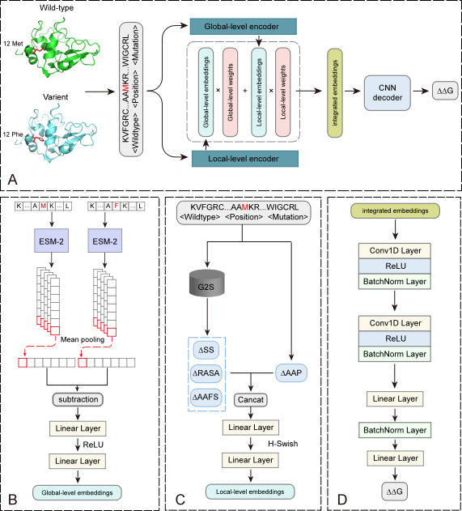
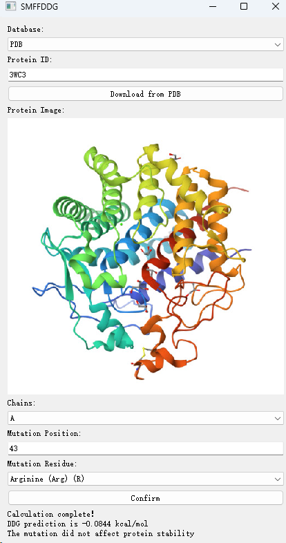

# SMFFDDG

**SMFFDDG**（Single Mutation Feature Fusion for ΔΔG prediction）是一种用于预测蛋白质单点突变后热力学稳定性变化（ΔΔG）的深度学习模型。该方法融合了 **局部表示（Local-level）** 和 **全局表示（Global-level）**，在准确性与可解释性之间实现了有效平衡。

---

## 🧬 研究思路

蛋白质的单点突变（single-point mutation）可能显著影响其热力学稳定性（ΔΔG），准确预测这种变化对于蛋白质工程与精准医疗具有重要意义。

传统方法大致分为两类：

- 基于物理化学特征的方法，擅长建模局部环境变化，偏向于描述**焓变（enthalpy）**；
- 基于深度学习蛋白质语言模型（PLM）的方法，能够自动建模全局序列语义变化，更侧重于**熵变（entropy）**。

这两类方法各有优劣，为充分利用两者的信息，我们提出了一种融合式框架——**SMFFDDG**，它集成了局部与全局两个层面的特征表示，从而提升了 ΔΔG 预测的准确性与稳健性。

---

### 🔧 SMFFDDG 模型由以下三个核心模块构成：

- **局部特征表示（Local-level Encoder）**  
  依赖 G2S 结构对齐结果，提取突变位点附近的结构环境信息，具体包括：
  - 氨基酸理化属性变化（ΔAAP）
  - 二级结构变化（ΔSS）
  - 相对可及表面积（RASA）
  - 溶剂可及氨基酸频率变化（ΔAAFS）

- **全局特征表示（Global-level Encoder）**  
  利用预训练的 ESM-2 模型对突变前后蛋白质序列进行编码，提取深度表示后，计算它们的**差值向量**，用于反映突变对整体序列语义的影响。

- **融合机制与解码器（Feature Fusion & Decoder）**  
  对局部特征和全局特征进行加权融合，送入由卷积层（CNN）和全连接层（FC）组成的解码器，最终输出 ΔΔG 预测值。

---

整体流程如下：

1. 提取局部特征：结构对齐 + 环境描述（G2S 提供结构信息）；
2. 提取全局特征：使用 ESM-2 获取突变前后序列嵌入并求差；
3. 将两类特征通过可学习的权重线性组合；
4. 送入解码器网络预测 ΔΔG。

该方法在多个基准数据集上均表现出色，在 Pearson 相关系数和 RMSE 等指标上超过现有主流方法，展现出良好的应用潜力。

---


## 🧱 模型结构图



**图1. SMFFDDG 模型架构**

- **(A)** 模型总览：包含局部编码器、全局编码器、特征融合模块和解码器；
- **(B)** *全局编码器*：使用 ESM-2 模型获取突变前后序列的表示，计算差异后送入线性层；
- **(C)** *局部编码器*：提取突变位点附近的 ΔAAP、ΔSS、RASA、ΔAAFS 等特征；
- **(D)** *解码器*：由卷积层和全连接层组成，用于预测 ΔΔG 数值。

---

## 🚀 使用方法

### 步骤 1：准备输入序列

将突变数据整理为 `.csv` 文件，格式可参考示例文件：./data/test/S669_with_ddg.csv 文件应包含突变位置、野生型和突变型氨基酸。
---

### 步骤 2：特征提取

运行特征提取脚本，获取全局和局部特征，并保存为 `.npy` 文件：

```bash
python get_fea.py --csv_path ./data/test/S669_with_ddg.csv --save_path ./data/test/S669/S669.npy
```
---

### 步骤 3：模型推理
加载已训练模型进行 ΔΔG 预测：
```bash
python predict_linear.py --test_path ./data/test/S669/S669.npy --model_dir ./Linear_model
```

### 复现工作

如需复现完整训练过程：

1. 使用 S2648 数据集进行特征提取；

2. 根据序列同源性进行五折划分；

3. 执行训练脚本：train_linear.py

---


## 🚀 交互式应用
为了便于使用，基于PyQt开发了一个交互式的GUI，可以在交互式界面选择不同的数据库（PDB、Uniprot或者手动输入），之后输入蛋白id，便会自动从对应数据库中下载对应的蛋白质，之后可以可以选择突变信息（突变位点、突变后的氨基酸残基）调用训练好的model进行热稳定性变化预测。界面展示如下

