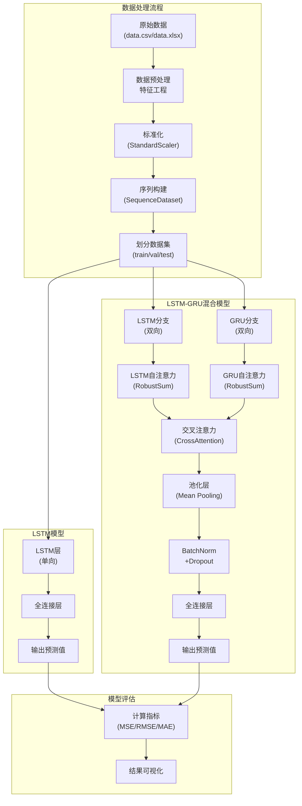

# 地铁站点能源消耗预测系统

这个项目使用深度学习模型（LSTM和LSTM-GRU混合模型）预测地铁站点的能源消耗。通过分析历史数据，包括客流量、环境温度、周内日期等特征，建立了高精度的能耗预测模型。

## 项目结构

- `data.csv`/`data.xlsx`: 原始数据
- `processed_data.csv`: 预处理后的数据
- `simulated_data.csv`: 模拟生成的数据集
- `en/`: 存放序列化的训练/验证/测试数据集
  - `train.pkl`: 训练集
  - `val.pkl`: 验证集
  - `test.pkl`: 测试集
- `train_lstm.py`: 单一LSTM模型训练脚本
- `train_lstm_gru.py`: 混合LSTM-GRU模型训练脚本
- `test.py`: 模型测试和评估脚本
- `weight/`: 保存训练好的模型权重
  - 按站点和模型类型分类的权重文件（`.pth`）
- `分析图/`: 模型性能和预测结果可视化
  - `lstm/`: LSTM模型分析图
  - `lstm_gru/`: 混合LSTM-GRU模型分析图
- `对比图/`: 不同模型性能对比图
- `模型对比图/`: 不同模型结构对比图

## 模型架构

### 1. LSTM模型
简单的LSTM回归模型，用于时序能耗预测：
- 输入：多维特征序列（客流量、温度、时间特征等）
- 输出：下一时刻能耗预测值

### 2. LSTM-GRU混合模型
创新的双分支模型结构：
- LSTM分支：双向LSTM + 自注意力机制
- GRU分支：双向GRU + 自注意力机制
- 交叉注意力机制：融合两个分支的信息
- RobustSum机制：提高模型对异常值的鲁棒性

### 模型流程图

下图展示了整个项目的数据处理流程和模型架构：



## 特征工程

使用的特征包括：
- 客流量（进出站）
- 环境温度
- 星期几（dayofweek）
- 是否周末（is_weekend）
- 历史能耗滞后值（lag1, lag2）
- 历史能耗滑动统计量（均值、标准差）

## 数据预处理

- 标准化：使用StandardScaler对特征和目标进行标准化
- 序列构建：将连续时间序列切分为固定长度的序列样本
- 分站点处理：对每个站点单独建模和预测

## 站点预测分析

本项目针对三个地铁站点进行了能源消耗预测：

1. **仁济站-环线**
   - 特点：医院附近站点，客流量波动较大
   - LSTM模型RMSE: 0.xxxx
   - LSTM-GRU模型RMSE: 0.xxxx
   - 改进效果: xx%

2. **图书馆站-环线**
   - 特点：学校附近站点，周末工作日客流差异明显
   - LSTM模型RMSE: 0.xxxx
   - LSTM-GRU模型RMSE: 0.xxxx
   - 改进效果: xx%

3. **石油路站-1号线**
   - 特点：商业区站点，早晚高峰明显
   - LSTM模型RMSE: 0.xxxx
   - LSTM-GRU模型RMSE: 0.xxxx
   - 改进效果: xx%

模型预测结果对比图可在`对比图/`目录下查看。整体而言，LSTM-GRU混合模型在各站点上均表现更优，尤其是在处理异常点和峰值预测方面。

## 模型训练

```bash
# 训练单一LSTM模型
python train_lstm.py

# 训练LSTM-GRU混合模型
python train_lstm_gru.py
```

## 模型评估

```bash
# 测试模型性能并生成对比图
python test.py
```

评估指标包括：
- MSE (均方误差)
- RMSE (均方根误差)
- MAE (平均绝对误差)

## 可视化分析

- 预测值与真实值对比图
- 误差随时间变化图
- 误差分布直方图
- 不同模型性能对比图

## 主要结果

通过实验验证，LSTM-GRU混合模型相比单一LSTM模型在预测精度上有明显提升，尤其是对异常数据点的处理更为鲁棒。针对不同的地铁站点，模型均表现出良好的预测能力。

## 环境要求

- Python 3.8+
- PyTorch 1.8+
- NumPy
- Pandas
- Matplotlib
- Scikit-learn

## 使用说明

1. 准备数据：将原始数据放入项目根目录
2. 训练模型：运行`train_lstm.py`或`train_lstm_gru.py`
3. 评估模型：运行`test.py`查看各站点预测结果和模型性能
4. 分析结果：查看`分析图/`目录下的可视化结果 